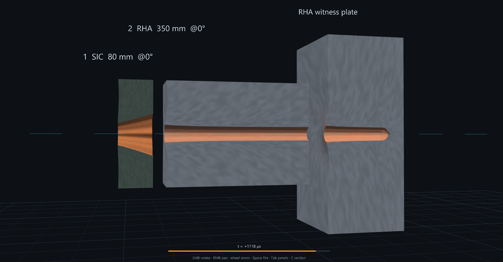
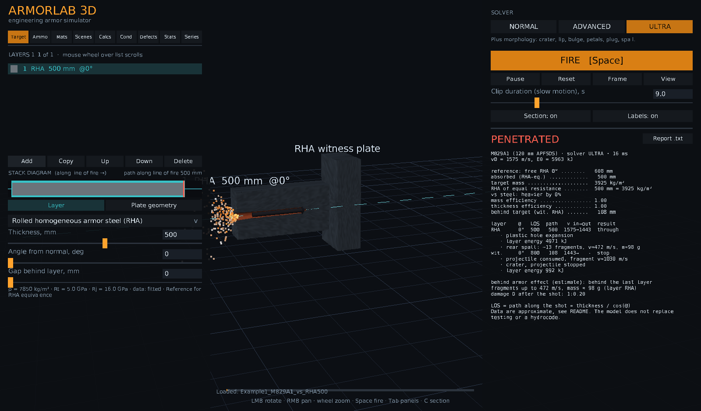
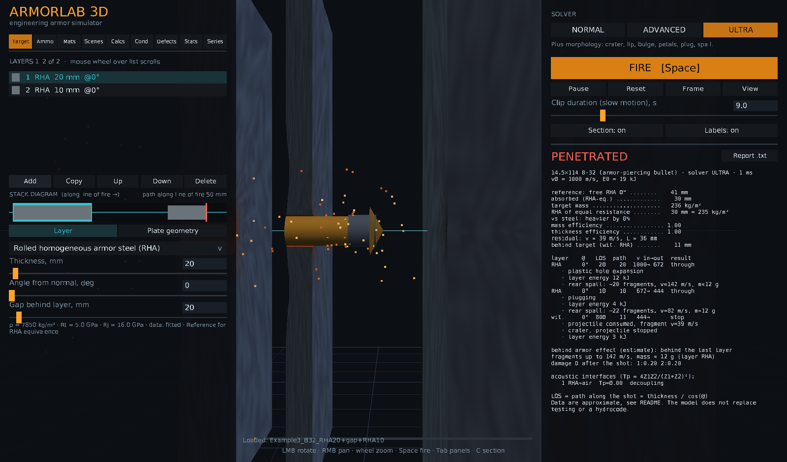
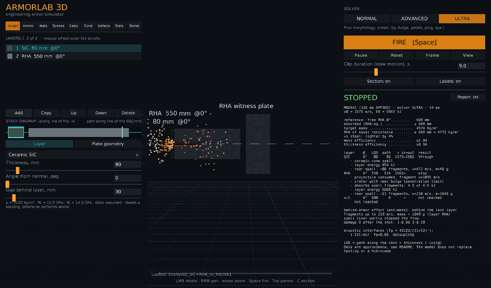

# ArmorLab 3D

Desktop 3D armor-penetration simulator (Python, Panda3D, NumPy). The UI is in Russian; the source comments are mostly Russian too.

You build a target from plates (material, thickness, obliquity, air gap), pick a projectile and fire.
The scene shows rod/jet erosion, crater, plug, petalling, spall, and a cut-away view of the channel.

> **Research / educational prototype.** It is a reduced-order engineering model, not a hydrocode and not a validated
> design tool. Almost all material and ammunition numbers are order-of-magnitude values and are marked as such in the
> code (`src` field: `measured`, `derived`, `fitted`, `assumed`; most are `assumed` or `fitted`). Do not use the output
> for real armor design, certification or safety-critical decisions.

Documentation (also suitable for GitBook): see the [`docs/`](docs/README.md) folder.

## What is modelled

| Area | Model |
|---|---|
| Long rods and bullets (APFSDS, AP) | Tate–Alekseevskii erosion model, brittle core fragmentation, ceramic backing effect, ricochet threshold (adjustable) |
| Shaped-charge jets (HEAT, tandem) | Discrete jet elements with velocity gradient, stretching, velocity cut-off, Bernoulli hydrodynamics with strength; ceramic coherence loss; ERA (reactive armor) plate cutting |
| Hypervelocity (v > 3 km/s) | Cour-Palais penetration depth, shock-Hugoniot vaporization, debris-cloud cone for Whipple shields; calibrated against the NASA/Christiansen ballistic-limit equation for Al on Al at 7–15 km/s, normal impact (about 8 % RMS on the fit, about 10 % off the fit) |
| Conditions | Temperature, porosity, load cycles, accumulated damage D (multi-hit), thermal-shock damage and its synergy with impact damage, welded seams, surface cracks, 1D transient heating through the layer stack |
| Series / multi-hit | Hit dispersion, 61×61 damage grid per layer, crack transfer between layers, local ERA tiles |
| Analysis | Monte-Carlo V50, energy per layer, mass efficiency, acoustic interface report, 17 engineering calculators (De Marre, Tate, Mises, impact pressure, ...) |

Three solver levels: NORMAL (fast), ADVANCED (energy per layer, ERA, brittle cores), ULTRA (adds crater morphology).

## Run

Windows: install Python 3.10–3.13 and double-click `run.bat` (creates `.venv` and installs dependencies on first start).
Manual: `pip install -r requirements.txt` then `python main.py`.
Headless check of the solver: `python selftest.py`.

Controls: LMB rotate, RMB pan, wheel zoom, Space fire, P pause, R reset, C cut-away, L labels, Tab hide panels.

## Content

- Materials (see `armorlab/data.py`): RHA, mild steel, high-hardness steel, Al 5083 / 7039, Ti-6Al-4V, depleted uranium, Al2O3, SiC, B4C, UHMWPE, aramid, elastomers, concrete, insulation, plus a separate ERA layer type. Custom materials can be added in the UI.
- Ammunition: several APFSDS rounds, AP bullets and fragments, micrometeoroids, and shaped-charge warheads (PG-7, TOW-2A, Hellfire, tandem examples).
- `scenes/`: a few example scenes (JSON) you can load from the "Scenes" tab.

## Gallery

Cut-away view of the 3D scene (hole growth, rear spall, projectile erosion, and the result report on the right).



*M829A1 vs SiC 80 mm + RHA 350 mm: the rod erodes through the ceramic and steel and reaches the witness plate (t = +1118 µs).*

| | |
|---|---|
|  |  |
| *M829A1 vs 500 mm RHA: rod in the channel, spall at the entry* | *14.5x114 B-32 through two plates, side section* |



*SiC + 550 mm RHA stops M829A1 at 1575 m/s; spall fragments and witness plate shown.*

## Files

```
main.py              entry point
armorlab/data.py     materials, cores, ammunition
armorlab/solver.py   physics (Tate, jet, morphology, conditions)
armorlab/hyper.py    hypervelocity and Whipple shield estimate
armorlab/thermal1d.py 1D heat conduction through layers
armorlab/series.py   multi-hit series and damage grid
armorlab/analysis.py Monte-Carlo V50 and charts
armorlab/calc.py     engineering calculators
armorlab/scene3d.py, meshes.py, ui.py, app.py   3D scene and GUI
selftest.py          headless regression checks
```

## Custom materials

Users can extend the material database by editing `armorlab/data.py`, by adding materials in the **Mats** tab (saved to `materials_user.json`), or by loading scene JSON files that carry their own materials. This allows testing proprietary alloys or composites without modifying the core solver.

## Known limitations

- Reduced-order model: no full 3D continuum mechanics, straight trajectory (no rod deflection), ricochet default threshold is not calibrated.
- ERA and ceramic damage radii are assumptions; no real tile structure is modelled.
- Hypervelocity calibration covers only Al on Al; other materials are extrapolations.
- Coefficients (thermal, synergy, defects, self-sharpening) are assumptions, not measurements.

## License

MIT, see [LICENSE](LICENSE).
